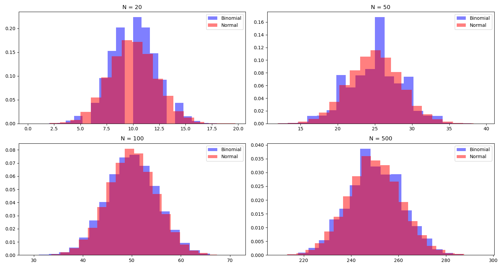

# Convergence of Binomial to Normal Distribution

The binomial distribution converges to the normal distribution as the number of trials, \( N \), becomes large. This behavior is an implication of the Central Limit Theorem.

## Visual Proof

Below are histograms comparing the binomial distribution (in blue) to the normal distribution (in red) for increasing values of \( N \).

As can be seen from the histograms, as \( N \) increases, the binomial distribution increasingly resembles the shape of the normal distribution.

## Mathematical Basis

For the binomial distribution with parameters \( N \) and \( p \):

- Mean \( \mu = Np \)
- Variance \( \sigma^2 = Np(1-p) \)

As \( N \) becomes large, due to the Central Limit Theorem, the binomial distribution will approximate a normal distribution with the same mean \( \mu \) and variance \( \sigma^2 \).

---

End of Presentation.
